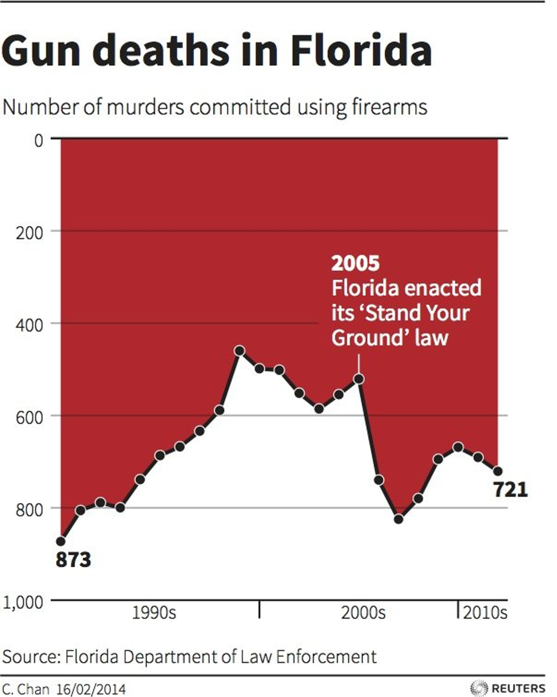
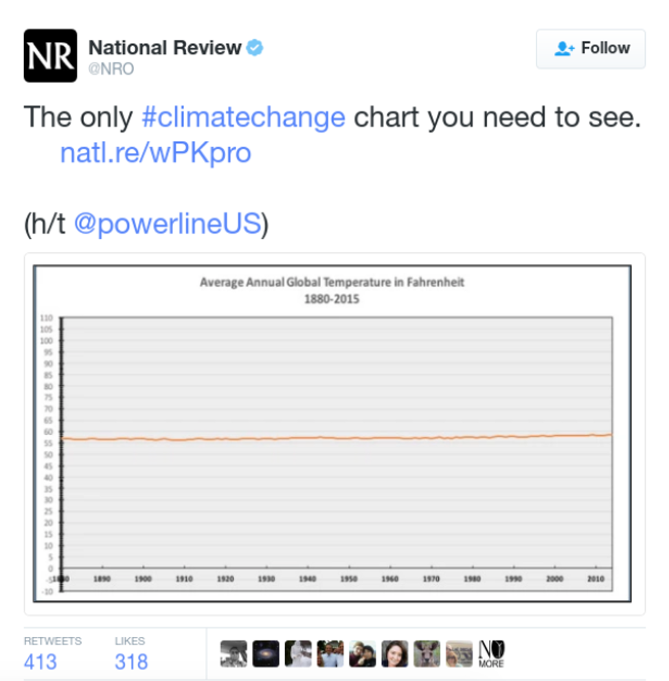
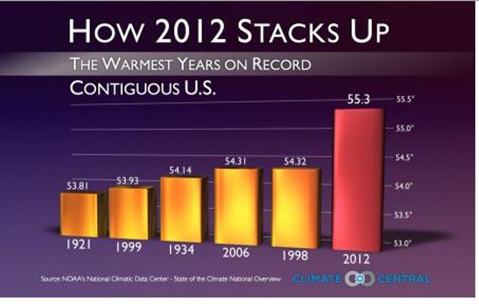
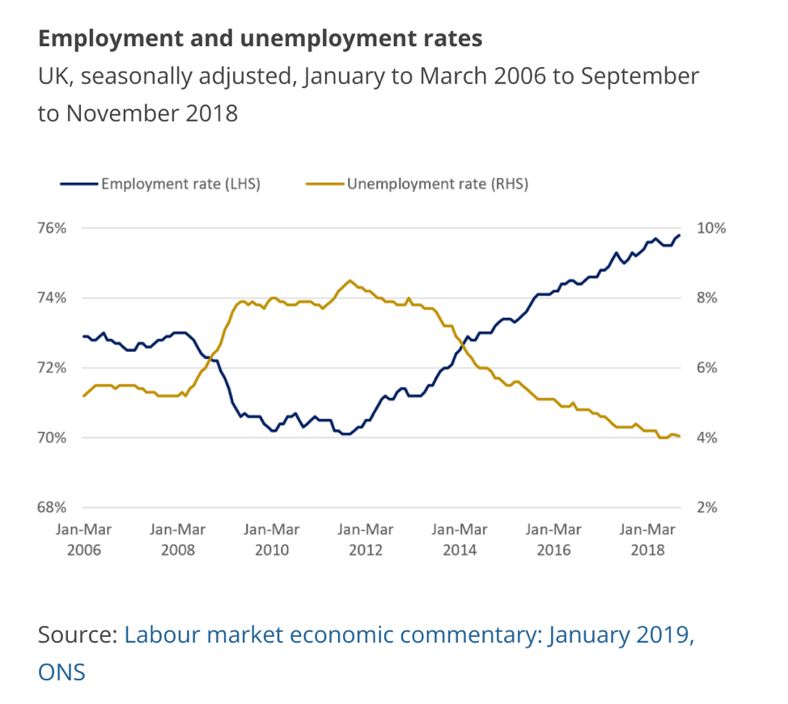

# Data Ethics

## Misleading Graphics

```{r , include=FALSE}
knitr::opts_chunk$set(echo = TRUE, message=FALSE, warning=FALSE, fig.height = 4, fig.width = 6)
```

Scenarios 1 and 4 are from from [Modern Data Science with R](https://beanumber.github.io/mdsr2e/ch-ethics.html) by Baumer, Horton, and Kaplan.


The following graphics were all created in ways that are intended to mislead the viewer. Identify the misleading features of each graph. How does publishing and sharing such figures potentially harm society?

### Example 6.1.1 {-}


Source:  https://www.buzzfeednews.com/article/katienotopoulos/graphs-that-lied-to-us


### Example 6.1.2 {-}


Source: https://venngage.com/blog/misleading-graphs/

### Example 6.1.3 {-}

Figure 3:

Source: https://www.climatecentral.org/gallery/graphics/its-official-2012-is-hottest-us-year-on-record

### Example 6.1.4 {-}


Source: https://digitalblog.ons.gov.uk/2019/07/03/dueling-with-axis-the-problems-with-dual-axis-charts/


## Collecting, Storing, and Reporting Data

### Example 6.2.1: Ethics of Webscraping 

In May 2016, the online OpenPsych Forum published a paper titled “The OkCupid data set: A very large public data set of dating site users”. The resulting data set contained 2,620 variables—including usernames, gender, and dating preferences—from 68,371 people scraped from the OkCupid dating website. The ostensible purpose of the data dump was to provide an interesting open public data set to fellow researchers. These data might be used to answer questions such as this one suggested in the abstract of the paper: whether the Zodiac sign of each user was associated with any of the other variables (spoiler alert: it wasn’t).

The data scraping did not involve any illicit technology such as breaking passwords. Nonetheless, the author received many comments on the OpenPsych Forum challenging the work as an ethical breach in doxing people by releasing personal data. Does the work raise actual ethical issues?


### Example 6.2.2: Data Security and Storage

In 2011, The University of North Carolina first attempted to fire, then demote Professor Bonnie Yankaskas, a leading cancer researcher, after her lab failed to securely store confidential information about its patients. Read [this article] (https://www.insidehighered.com/news/2011/01/27/security-hacks). 

Was the University justified in firing or demoting Yankaskas? Justify your answer. 


### Example 6.2.3: Reproducible Analysis

In 2010, Harvard economists Carmen Reinhart and Kenneth Rogoff published a report entitled Growth in a Time of Debt Rogoff and Reinhart (2010), which argued that countries which pursued austerity measures did not necessarily suffer from slow economic growth. These ideas influenced the thinking of policymakers—notably United States Congressman Paul Ryan—during the time of the European debt crisis.

Graduate student Thomas Herndon requested access to the data and analysis contained in the paper. After receiving the original spreadsheet from Reinhart, Herndon found several errors.

“I clicked on cell L51, and saw that they had only averaged rows 30 through 44, instead of rows 30 through 49.” —Thomas Herndon Roose (2013)

In a critique Herndon, Ash, and Pollin (2014) of the paper, Herndon, Ash, and Pollin point out coding errors, selective inclusion of data, and odd weighting of summary statistics that shaped the conclusions of the Reinhart/Rogoff paper.

see https://blogs.lse.ac.uk/politicsandpolicy/public-debt-gdp-growth-and-austerity-why-reinhart-and-rogoff-are-wrong/

Does publishing a flawed analysis raise ethical questions?


## Ethical Guidelines

For more discussion of data ethics, see [Chapter 8 of Modern Data Science with R]
(https://mdsr-book.github.io/mdsr2e/ch-foundations.html#samples-and-populations) by Baumer, Horton, and Kaplan. These authors suggest that data scientists apply the following three principles when conducting their work. 

* Do your work well by your own standards and by the standards of your profession.    

* Recognize the parties to whom you have a special professional obligation.     

* Report results and methods honestly and respect your responsibility to identify and report flaws and shortcomings in your work.     

